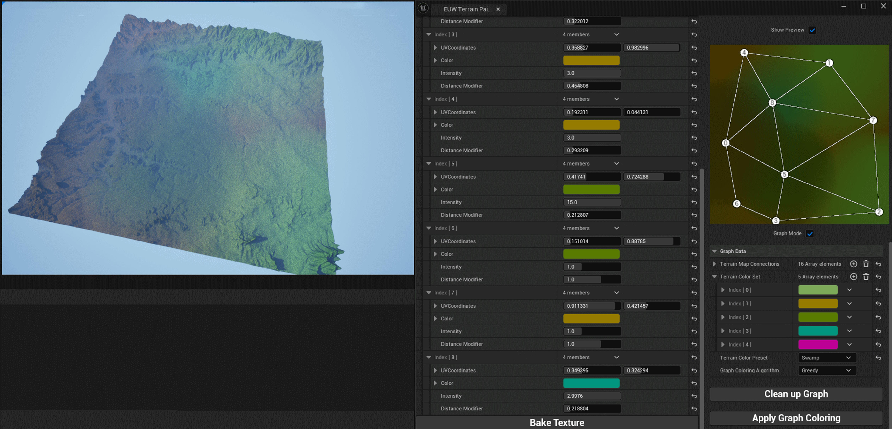
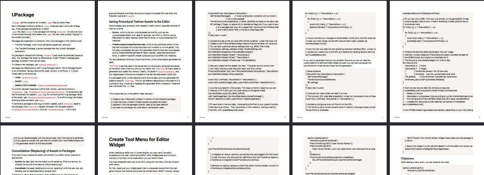
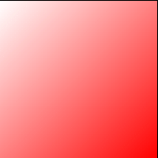
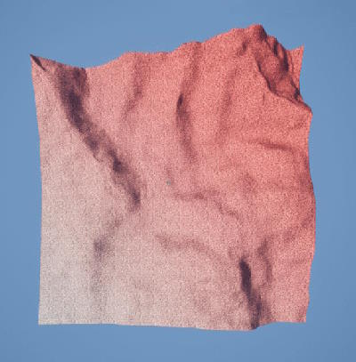
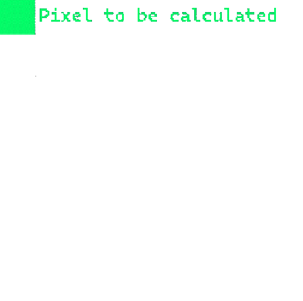
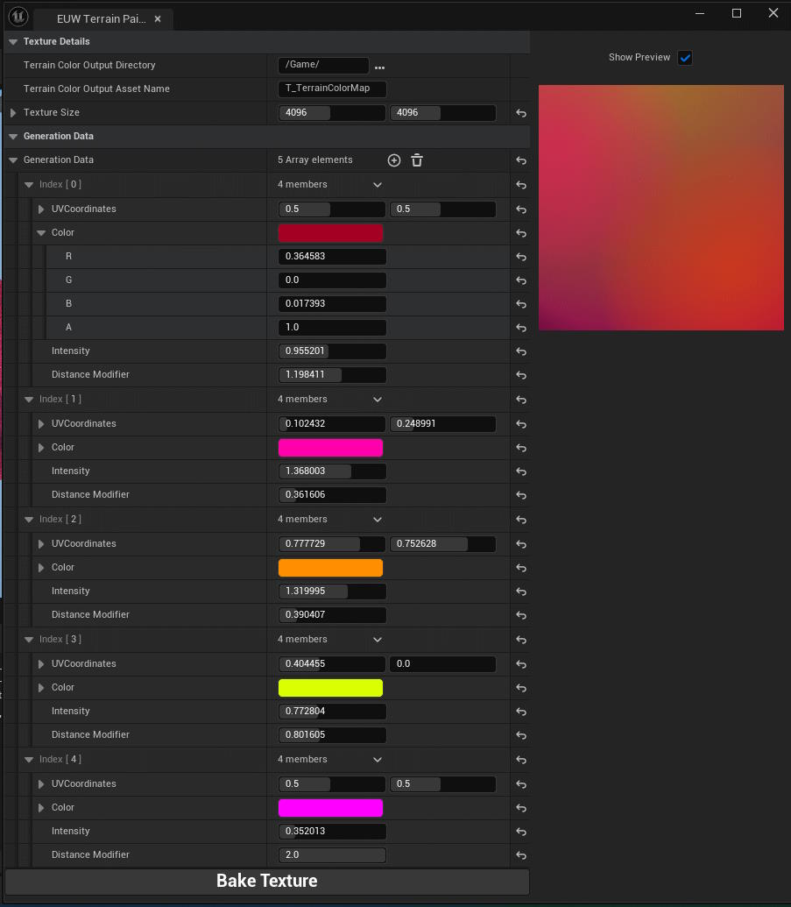
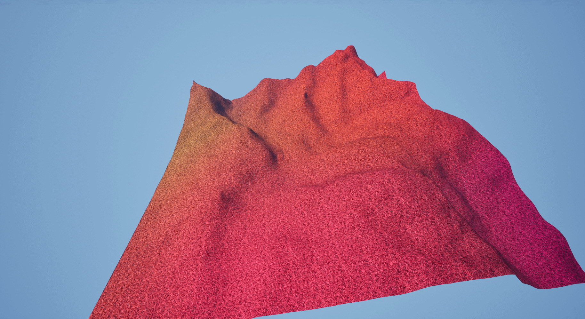
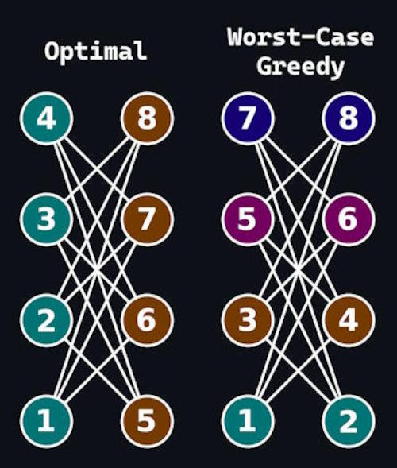
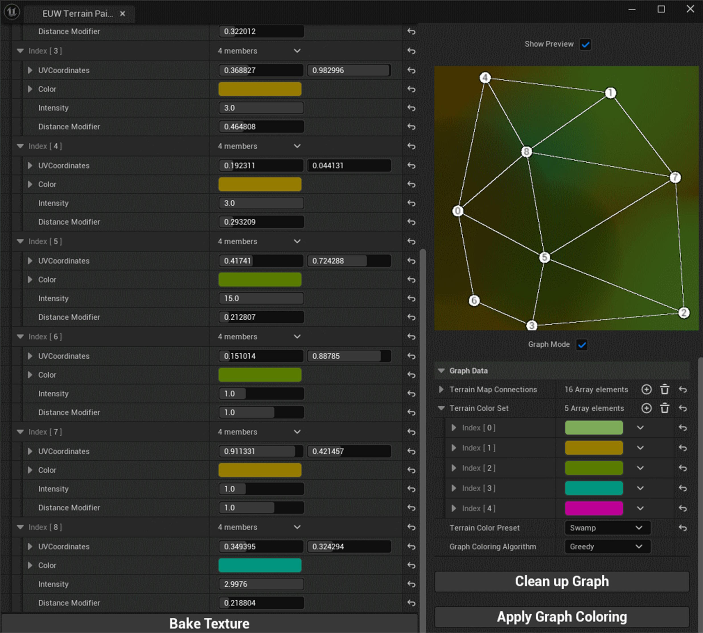
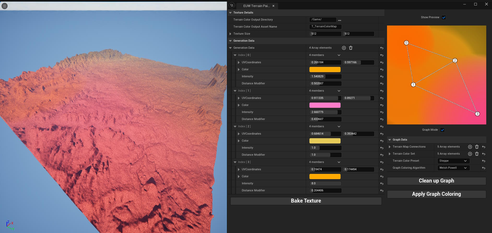

# Terrain Color Painter: Coloring Terrain using Graph Coloring Algorithms

## Table of Contents
- [Abstract](#abstract)
- [Implementation: The Tool](#implementation-the-tool)
	- [Texture Generation](#texture-generation)
- [Concepts: Graph Coloring](#concepts-graph-coloring)
	- [Greedy Coloring](#greedy-coloring)
	- [Welsh-Powell Algorithm](#welsh-powell-algorithm)
	- [DSatur](#dsatur)
- [Implementation: Graph Coloring](#implementation-graph-coloring)
- [Tool: Potential Improvements](#tool-potential-improvements)
- [Conclusion](#conclusion)
- [Sources \& References](#sources--references)


## Abstract
Generating & coloring large terrain in video games can be a time-consuming process requiring either complex Houdini pipelines or built-in tools such as Unity's `Terrain Tools`, Unreal's `Landscape`, or Godot's `Terrain3D`.

Depending on your tooling, iterating on coloring specifically can become cumbersome: Create a texture manually in an image editing software and then adjust & reimport it until it looks as right as you need it to be.

For e.g. prototyping, this might be more time than you are willing to spend on this aspect.

Offering an alternative, generate a color texture using this editor tool:


<br>
<sub>*Final result on the left, after designing the graph on the right*</sub>

## Implementation: The Tool
This project began by implementing the tool that allows the user to generate coloring. I decided to implement this in Unreal Engine, as I have never written an editor tool in it (and was curious about the process).

This ended up being quite the process in and of itself; most of the documentation on Unreal's editor tooling in C++ boils down to "read the source code", so much so that I ended up compiling the information in some general documentation on how to make editor tools, which is available [here](https://www.notion.so/Unreal-Engine-Tool-Information-1ff2fd6fa33e801bb574e533e8dc19a2):

[](https://www.notion.so/Unreal-Engine-Tool-Information-1ff2fd6fa33e801bb574e533e8dc19a2)

Making this tool, it was very important to move in articulable steps. The first of these was letting the user bake a texture asset.

For this, I use a function that works as a pseudo fragment shader, drawing pixels to the texture one by one:
```cpp
FColor UTerrainPainter::ComputeColorForPixel(int32 X, int32 Y)
{
	const FVector2f uv{
		static_cast<float>(X) / static_cast<float>(TextureSize.X),
		static_cast<float>(Y) / static_cast<float>(TextureSize.Y)
	};
	const float blend{ FMath::Clamp((uv.X + uv.Y) / 2.f, 0.0f, 1.0f) };
	const FLinearColor color{ 1.0f, 1.0f - blend, 1.0f - blend, 1.0f };
	return color.ToFColor(false);
}
```

This draws a red-to-white corner-to-corner gradient directly onto the first mip of the texture, resulting in this texture:


<br>
<sub>*Gradient texture generated on the CPU using the above*</sub>

Saving this to disk as a `.uasset` file, Unreal's standard asset format, turned out to be rather difficult due to it being (as mentioned before) largely undocumented.

After figuring that out, along with how to blend the texture with a simple grass texture in a Shader, this was the first result:


<br>
<sub>*The texture applied to a piece of heightmap terrain generated in blender; heightmap is of [this](https://manticorp.github.io/unrealheightmap/#latitude/49.80963156356313/longitude/2.724609375/zoom/7/outputzoom/13/width/8129/height/8129) location, © <a href="https://www.mapzen.com/rights">Mapzen</a>,  <a href="https://openstreetmap.org/copyright">OpenStreetMap</a> , and <a href="https://www.mapzen.com/rights/#services-and-data-sources">others</a>.*</sub>

So far so good. Let's get to actually generating texture we *want* to display.

### Texture Generation

The general process functions like this:



1. A series of points are defined in UV-Space; each is associated with a color

2. For this pixel, calculate the influence each point has on the current pixel based on it's UV location using the inverse distance

3. Blend the colors of all points depending on it's influence

4. Next pixel onwards from step 2 until the texture is filled in

In reality, there are extra factors to configure for each point, namely the `Distance Modifier` and `Intensity`.

- distance modifier linearly scales the distance a point can affect a pixel, no matter how minimally; `1.0` being over the entire texture, `0.5` being over half the texture

- Intensity multiplies the amount of weight the point's color has on the pixels within it's radius

Combining both of these in practice results in an editor window like this:


<br>
<sub>*The 'Show Preview' toggle exists here to prevent stutters; changing values on a high-resolution while the preview is enabled will regenerate the texture for every change, which might cause lag on lower-end machines.*</sub>

Now you can see each point we can place on the texture is defined by:
- UV Coordinates
- Color
- Intensity
- Distance Modifier

Allowing for a ton of customizability in generating these textures. This process is still very manual, but can already result in some interesting terrain coloring when baked into a color overlay texture:



Let's make this less manual using Graphs.

## Concepts: Graph Coloring

Vertex coloring refers to the process of assigning colors to a graph so that no two connected vertices share a color; the goal is to color in the graph using the least amount of colors possible. The optimal minimum amount of colors to do this is referred to as the graph's **chromatic number**.

This, however, is an **NP-hard problem**; finding the optimal coloring layout requires checking all combinations individually and selecting the one with the least colors, meaning the time complexity is $O(n^{n})$<sup>[1]</sup>. There is no algorithm that can guarantee finding the optimal coloring for all graphs in less than this.

There are, however, a lot of heuristics. Graph coloring is applicable to a surprising amount of other fields, such as timeslot scheduling, radio tower frequency assignment, and many more<sup>[2]</sup>.

The ones implemented in this project are **Greedy Coloring**, **Welsh-Powell**, and **DSatur**. These are all part of the most commonl y used type of graph coloring algorithms: Sequential coloring algorithms (it will become apparent why they are referred to as this). The following will discuss each implementation.

The descriptions may use these terms:
- A **Low/High color** is simply a color with a low/high index in our color list; indices are frequently used instead of literal RGBA values when implementing these algorithms
- The **Degree of a vertex** is the number of edges connected to it
### Greedy Coloring
This is the most basic of the 3 algorithms. It:
1. Loops over all vertices in arbitrary order
2. For each vertex, assign the lowest color that it's neighbors aren't using yet

While certainly having a blazing fast time complexity of $O(n)$<sup>[1]</sup>, this algorithm can produce incredibly subpar results, depending on the graph and the vertex ordering. For example, consider crown graphs:


<br>
<sub>*For crown graphs greedy coloring may use $\frac{V}{2}$ colors, with the cromatic number being $2$*</sub>

### Welsh-Powell Algorithm
Welsh and Powell found that ordering the vertices by Degree first and then running greedy coloring produces significantly better results. This ordering results in the algorithm still being $O(n)$, but the graph uses at most $\max_i \min\{ d(x_i) + 1,\ i \}$ colors, so 1 more color than the maximum vertex degree of the graph.

This method is also exact (meaning: provides the optimal solution) for bipartite, wheel, and cycle graphs.

### DSatur
DSatur, short for *degree of saturation*, is an algorithm that is different in the sense that it doesn't just linearly loop over the vertices. It:
1. Picks an uncolored vertex with the lowest number of already colored neighbors
2. Assigns the lowest color that it's neighbors aren't using yet
3. Re-evaluate step 1 for the next vertex

This method is exact for bipartite graphs<sup>[3]</sup> and runs in $O(n^{2})$ time. In exchange, it may produce a number of colors closer to the chromatic number for certain graphs.

## Implementation: Graph Coloring
Now that the concepts have been explained, let's apply graph coloring to this project.

The final version of the tool allows you to create a graph of vertices with connections. Then, when you press **Apply Graph Coloring** colors from your **Terrain Color Set** are assigned to your vertices; a few color presets are available under the **Terrain Color Preset** selector.

You may switch which implementation of graph coloring is running using the **Graph Coloring Algorithm** selector. All 3 of the aforementioned algorithms are present.


<br>
<sub>*'Clean Up Graph' simply deletes duplicate connections and re-orders them into a logical sequence.*</sub>


## Tool: Potential Improvements
1. The tool could allow for texture blending in addition to color blending; each vertex would be assigned a texture that ends up being considered for each pixel at editor-time with it's weight

2. The color baking, preview creation, and graph texture generation should most certainly be done in a compute shader instead of a blocking, single-threaded CPU loop. This would significantly improve editor performance, which can heavily dip at texture above a resolution $1024^{2}$


## Conclusion
Graph coloring has a strong potential for use in game development, specifically in terrain coloring. The tool itself, with minimal use, can produce rather interestingly colored pieces of terrain:


<sub>This uses the 'Steppe' color template and only the intensity and distance modifier values of the vertices are slightly modified.</sub>

This can be useful for quick iteration: Creating these color textures is incredibly simple once the process is understood. For fully featured terrain, however, the mentioned processeses (mainly: A proper Houdini pipeline) are still vastly superior due to their increased control & customizablity. Additionally, when terrain is large enough to have dozens of biomes, this tool specifically becomes cumbersome to use.

Terrain coloring could become part of these pipelines in the future, but whether this will improve either efficacy or efficiency is debatable.


## Sources & References
[1]: *"13 Graph Colouring Algorithms" by David Eppstein (2015)* -  p. 22 discusses the complexities of all common graph coloring algorithms. Find the [survey paper here](https://arxiv.org/pdf/1505.05825) :)
<br>
[2]: *"Graph Colouring, Class Scheduling and Application in Modern Computer Science" by IJRASET (2023)*
<br>
[3]: *"New methods to color the vertices of a graph" by Daniel Brélaz*
